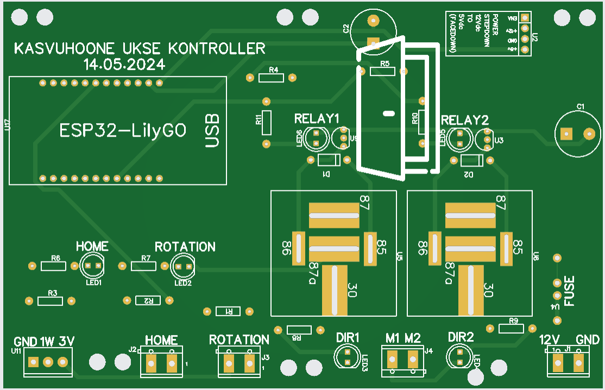

# R2hni-Kasvuhoone-Avaja

Automatic greenhouse vent door controller for ESP32 (LilyGO TTGO T-Display).

Reads a DS18B20 temperature sensor and drives a motor-actuated vent door
open/closed based on configurable temperature thresholds. Door position is
tracked via a rotary encoder pulse (`countPin`) and a home limit switch.

## Hardware

| Signal | Pin | Notes |
|---|---|---|
| `cwPin` (close) | 13 | motor output |
| `ccwPin` (open) | 17 | motor output |
| `countPin` | 33 | rotary encoder / reed input, counts door travel |
| `homeSwitchPin` | 32 | door-closed limit switch |
| `revOut` | 22 | mirrors `countPin`, external indicator |
| `homeOut` | 21 | mirrors home switch state, external indicator |
| DS18B20 (OneWire) | 25 | temperature sensor |

Display: built-in TFT on the TTGO T-Display (`TFT_eSPI`).

## Behavior

- **Temp ≤ `lowTemp`** (default 26°C): door closes fully.
- **Temp ≥ `highTemp`** (default 32°C): door opens fully.
- **In between**: door position scales linearly between 0 and `maxDoorState`
  (700 encoder steps) based on temperature.
- After each move the controller counts down `countDownTimer` seconds
  (default 600) before re-measuring and re-adjusting.

## Safety / error lockout

Two independent stall detectors trigger `errorLockOut()` (motor off, LEDs
blink) during any door move or startup homing:

- **Overall move timeout** (`errorLockOutTime`, 5min) — move is taking far
  longer than the measured ~250sec full-travel time.
- **Pulse-stall guard** (`pulseStallTimeout`, 10sec) — `countPin` should
  toggle roughly every 2.8sec while the motor runs; no pulse for 10sec means
  the door is jammed or the motor/encoder is disconnected.

A lockout does not require a power cycle: connect to the device's IP and
open `/lockout` to see status, or `POST /lockout/reset` to clear it and
retry the move.

Temperature reads are also guarded: a DS18B20 conversion timeout or CRC
mismatch returns a `-127.0` sentinel, which the control logic treats as
"temperature low" — the safe fail direction is to close the door.

## Setup

1. Copy `secrets.h.example` to `secrets.h` and fill in your WiFi SSID and
   password. `secrets.h` is gitignored — never commit it.
2. Open `2025.05.24_Kasvuhoone.ino` in the Arduino IDE (or `arduino-cli`)
   with the ESP32 board package installed.
3. Required libraries: `PubSubClient`, `AsyncTCP`, `ESPAsyncWebServer`,
   `ElegantOTA`, `OneWire`, `TFT_eSPI` (configured for the TTGO T-Display).
4. Flash over USB. Subsequent updates can go over WiFi via ElegantOTA at
   `http://<device-ip>/update`.

## Web endpoints

| Path | Method | Purpose |
|---|---|---|
| `/` | GET | Hello text + build date |
| `/lockout` | GET | Error lockout status page |
| `/lockout/reset` | POST | Clear an active lockout |
| `/update` | GET/POST | ElegantOTA firmware update |

## Calibration notes

- `maxDoorState = 700` encoder steps is the safe max travel; 750+ bends the
  door hardware.
- Measured full close travel: ~250sec (4min10sec).

## PCB

Custom board for the ESP32-LilyGO with two relay outputs (motor direction),
home/rotation sensor headers, and a step-down for 12V input. Gerber files for
fabrication are in [`hardware/`](hardware/).
